# Natas Solution 0 a 15

### Introdução

 apresento uma análise detalhada dos níveis **[Natas](https://overthewire.org/wargames/natas/)** 0 a 15,
 disponível na plataforma de segurança ofensiva OverTheWire. O objetivo é registrar os métodos, conceitos e vulnerabilidades exploradas em cada desafio, permitindo tanto o entendimento dos mecanismos de segurança envolvidos quanto o desenvolvimento de habilidades práticas em web hack

## natas 0

O nível **[Natas 0](http://natas0.natas.labs.overthewire.org)** é o ponto de partida da série Natas. Ele ensina o jogador a inspecionar elementos simples em uma página web para encontrar informações escondidas.
A senha é encontrada ao inspecionar o codigo da paginha.

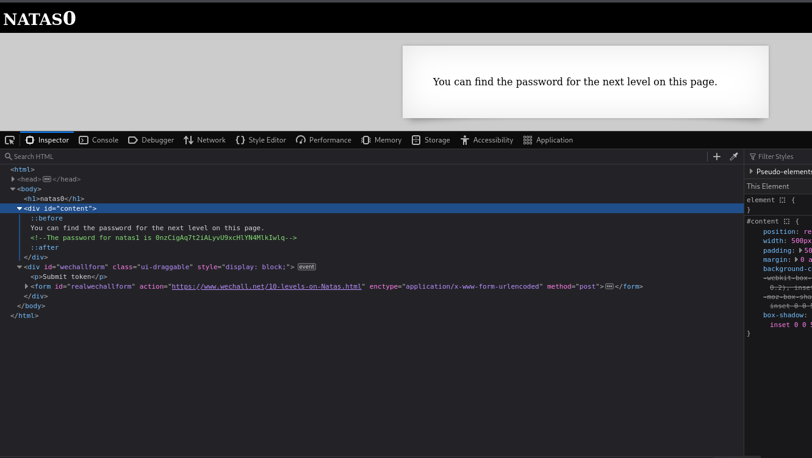

Senha: 0nzCigAq7t2iALyvU9xcHlYN4MlkIwlq

## natas 1

No [**natas 1**](http://natas1.natas.labs.overthewire.org) a vunerabilidade é a mesma, porem o inspecionar da pagina está bloqueado, entao ultilizamos o atalho "(Ctrl)+(Shift)+(i)" e o inspecionar é aberto.

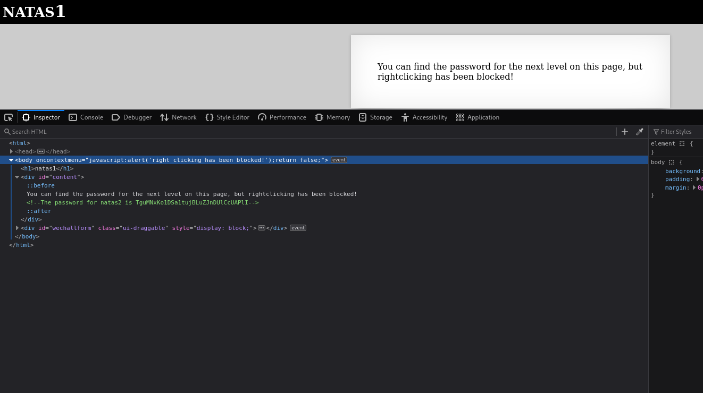

Senha: TguMNxKo1DSa1tujBLuZJnDUlCcUAPlI

## Natas 2

No [**natas 2**](http://natas2.natas.labs.overthewire.org) a vunerabilidade é encontrada em outras pastas disponiveis na web, ao dar "/files" encontramos uma pagina chamada users e la encontramos a senha do proximo desafio

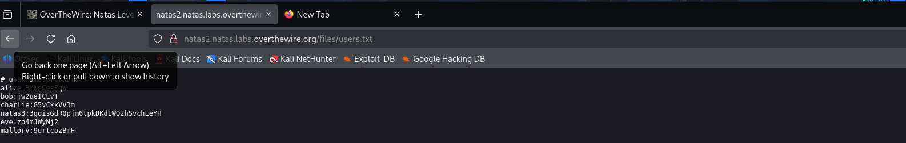

senha: 3gqisGdR0pjm6tpkDKdIWO2hSvchLeYH

## Natas 3
No [**natas 3**](http://natas3.natas.labs.overthewire.org)eu encontrei um caminho no diretoretorio "/robots.txt" que levava ate o diretorio "/S3CT3" onde ha a pasta usuarios e esta a senha 

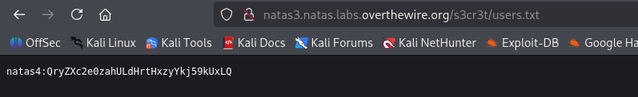

senha:QryZXc2e0zahULdHrtHxzyYkj59kUxLQ

## Natas 4

No [**natas 4**](http://natas4.natas.labs.overthewire.org) ele diz que para acessar a senha eu teria que estar vindo da url do Natas 5 entao usei a ferramenta "burp suite" para alterar a variavel Referer.

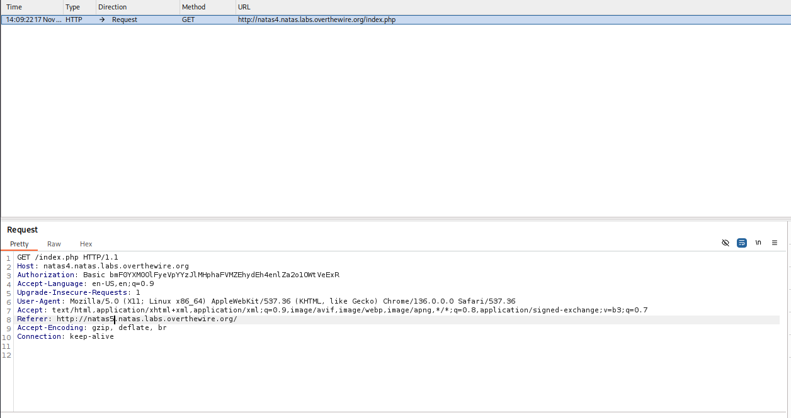

senha:0n35PkggAPm2zbEpOU802c0x0Msn1ToK

## Natas 5

No [**natas 5**](http://natas5.natas.labs.overthewire.org) tambem usando a ferramenta do "buirp suite" vamos alterar a variavel loggeding para leberar o acesso

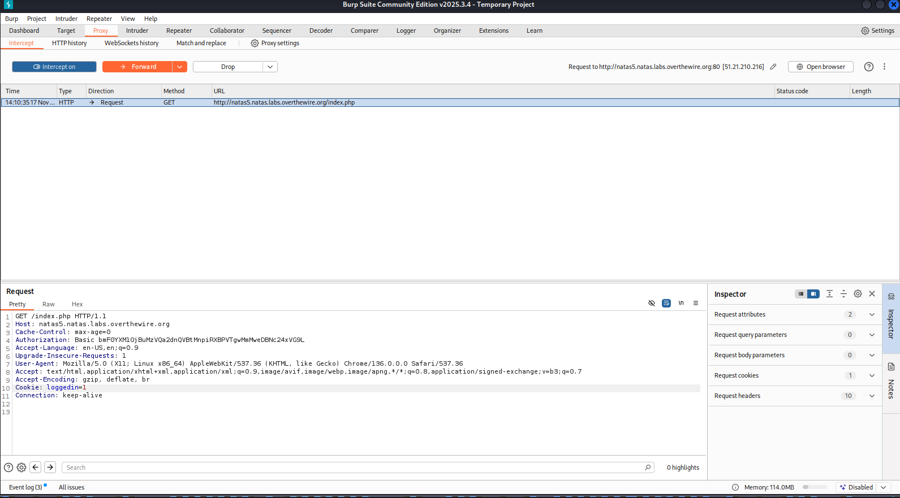

## Natas 6
No [**natas 6**](http://natas6.natas.labs.overthewire.org) clicando no link “view sourcecode”, vemos algo como "include "includes/secret.inc";". Isso indica exatamente onde a senha está armazenada, ao acrescentar isso na url "http://natas6.natas.labs.overthewire.org/includes/secret.inc" encontramos a senha 
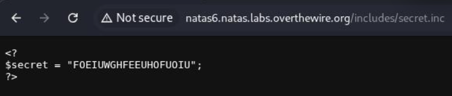

## Natas 8
No [**natas 8**](http://natas8.natas.labs.overthewire.org), você vê um formulário pedindo um secret.
Quando você tenta qualquer valor, ele diz que está errado.
Há também o link “view sourcecode”, que é onde está a pista principal, isso te leva a um codigo php, que aplica um codificação no secret, de binario para base 64, a resposta é simplesmente reverter a codificação e aplicar o resultado na pagina inicial
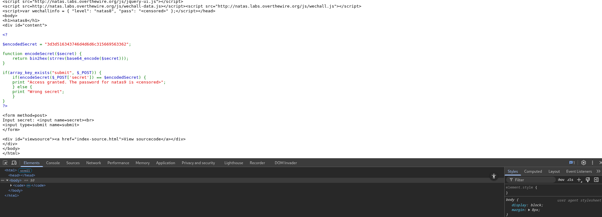

## Natas 9
No [**natas 9**](http://natas9.natas.labs.overthewire.org), você encontra um formulário que faz buscas usando o comando grep.
Olhando o “view sourcecode”, vemos que o input do usuário é colocado diretamente no comando "exec("grep -i $keyword dictionary.txt");" isso permite fazer injeção de comandos, como "; cat /etc/natas_webpass/natas10" que ja vai ser direcionado para a senha

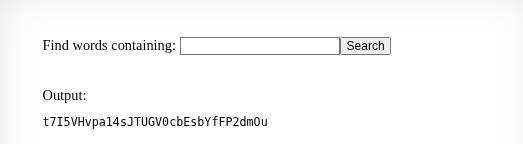

## Natas 10
No [**natas 10**](http://natas10.natas.labs.overthewire.org), o objetivo é o mesmo do 9, mas agora existe um filtro: alguns caracteres são proibidos (;, |, &).Olhando o código, vemos que ele usa "if (preg_match('/[;|&]/', $key)) { /* bloqueia */ }", Mas podemos usar a sintaxe do grep para buscar qualquer coisa, inclusive conteúdo de arquivos.O comando final é "grep -i "$key" dictionary.txt"
A forma mais simples de contornar isso é usar comando interno do grep ".* /etc/natas_webpass/natas11" encontrando a senha
senha: UJdqkK1pTu6VLt9UHWAgRZz6sVUZ3lEk

## Natas 11
No [**natas 11**](http://natas11.natas.labs.overthewire.org), você encontra um formulário que usa cookies para guardar configurações do usuário.
Ao abrir o “view sourcecode”, percebemos que o cookie é codificado com XOR + base64, podemos reverter o processo facilmente, basta decodificar o cookieaplicar XOR novamente e descobrir a chave. Com a chave, criamos um cookie modificado contendo "{"showpassword":"yes"}" e depois modificar o cookie da pagina assim obtendo acesso a senha
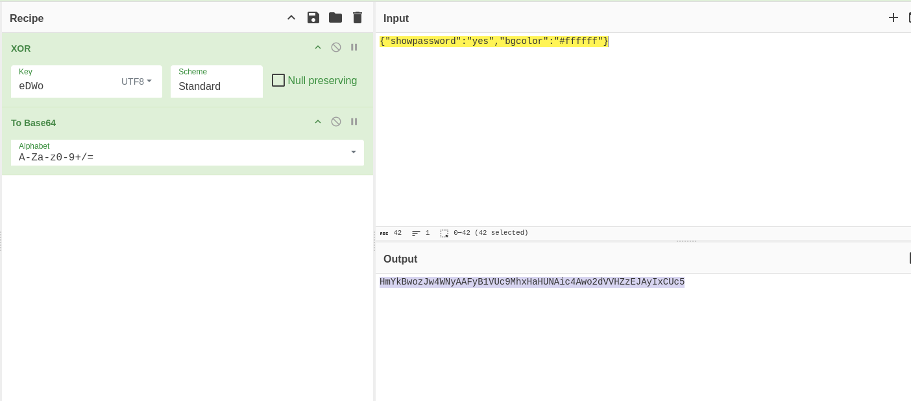

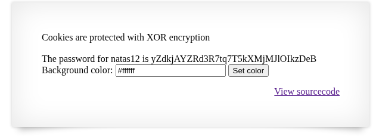

## Natas 12
No [**natas 12**](http://natas12natas.labs.overthewire.org), o site permite enviar um arquivo, mas ele só “troca” a extensão para .jpg com o comando "$filename = "img/" . rand() . ".jpg";" Mas o conteúdo do arquivo não é verificado, apenas o nome. Então podemos enviar um arquivo .php com o codigo "php echo file_get_contents('/etc/natas_webpass/natas13');", que vai ser renomeado para .jpg, depois abrimos o arquivo, renomeamos ela para .php na url e obtemos a senha
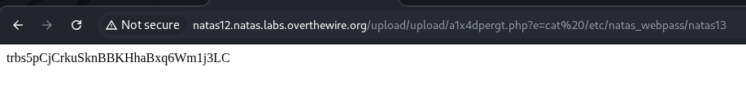

## Natas 13
No [**natas 13**](http://natas13natas.labs.overthewire.org), vai ser basicamente igual ao 12, porem existe uma verificação das caracteres iniciais do arquivo.jpg, para dispistar isso, podemos trocar os caracteres iniciais do nosso arquivo .php, para "GIF87a" e assim obter a senha
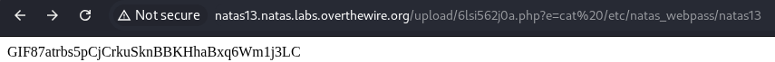

## Nastas 14
No [**natas 14**](http://natas14natas.labs.overthewire.org), o site usa login com SQL "SELECT * FROM users WHERE username="$u" AND password="$p";" sem nenhuma proteção, isso permite SQL Injection, para ignorar a senha e logar direto podemos uasar:

username: "admin" or 1=1 --

password: admin

Assim o SQL sempre retorna verdadeiro e o sistema nos deixa passar, revelando a senha do nível seguinte.
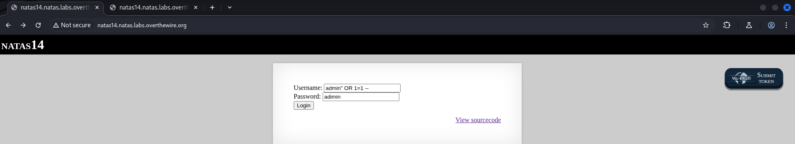

senha: SdqIqBsFcz3yotlNYErZSZwblkm0lrvx

## Natas 15 
No No [**natas 15**](http://natas15natas.labs.overthewire.org), temos uma página que verifica se um usuário existe no banco de dados. A resposta da página é sempre uma dessas duas:

"This user exists."
"This user doesn't exist."

O código usa uma consulta SQL vulnerável ao receber o valor do campo username.
Não há retorno da senha na tela, então é uma SQL Injection cega.

Para explorar isso, usamos o sqlmap, porque ele consegue testar o parâmetro automaticamente e extrair dados mesmo quando a aplicação não mostra erros SQL.

doda isso do sequir o passo a passo nas imagens e chegara no resultado

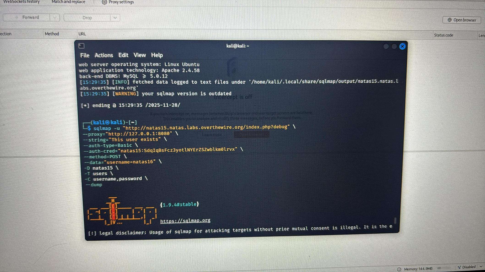

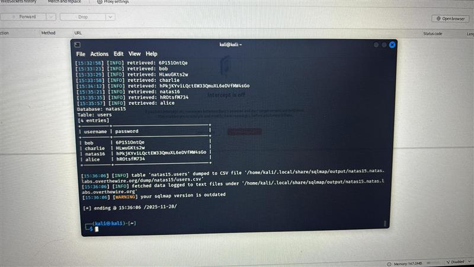

senha:hPkjKYviLQctEW33QmuXL6eDVfMW4sGo

 

